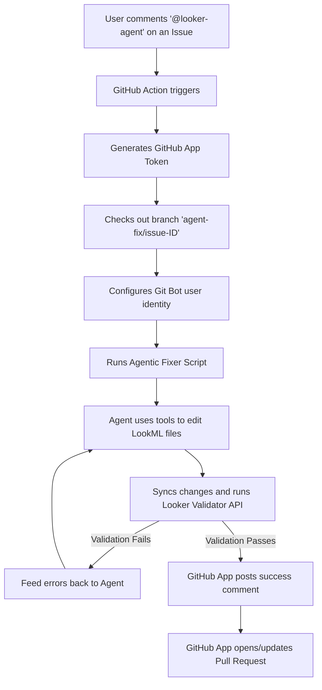

# Cymbal Gadgets: LookML Financial Modeling & Audit

This repository contains the LookML model and views for the **Cymbal Gadgets** dataset. As part of a financial audit and data modeling review, the core financial calculations have been restructured and corrected to align with standard financial accounting and auditing guidelines (GAAP/IFRS).

## Financial Model & Definitions

The following table summarizes how the financial metrics are defined in the schema and how they have been implemented in LookML:

| Metric | Business Definition | Mathematical Formula | LookML Field |
| :--- | :--- | :--- | :--- |
| **Gross Revenue** | Total sales value at list price before discounts, tax, or shipping. | `product_master_price * quantity` | `transactions.gross_revenue` |
| **Net Revenue** | Sales revenue retained by the company after customer discounts. | `gross_revenue - discountamount` | `transactions.net_revenue` |
| **COGS** | Direct Cost of Goods Sold (inventory cost to acquire/make). | `product_cost * quantity` | `transactions.cogs` |
| **Gross Profit** | Core profitability of sold products before operating expenses. | `net_revenue - COGS` | `transactions.gross_profit` |
| **Gross Margin %** | Gross profitability expressed as a percentage of net revenue. | `gross_profit / net_revenue` | `transactions.gross_margin_percentage` |
| **Lost Revenue** | Revenue from online orders that occurred >30 days ago but have null shipment status. | `net_revenue` (where channel is Online, age > 30 days, and shipment status is null) | `transactions.lost_revenue` / `transactions.total_lost_revenue` |

---

## Audit Finding & Correction

### The Schema Discrepancy
In the original database schema, `totalprice` is defined as:
```
totalprice = (product_master_price * quantity) - discountamount + taxamount + shippingcost
```
However, the original LookML implementation calculated **Gross Profit** as:
```
gross_profit = totalprice - (product_cost * quantity)
```

### Why This Was Financially Incorrect (Audit Finding)
1. **Sales Tax Inclusion:** Sales tax (`taxamount`) is a liability collected on behalf of the government and must be excluded from both Revenue and Profit. Including it inflated Gross Profit.
2. **Shipping Cost Inclusion:** Shipping charges (`shippingcost`) represent logistics/fulfillment fees. Including them directly in product gross profit without matching them against shipping expenses distorted product margin metrics.
3. **Discounts Treatment:** The original formula deducted discounts but did not cleanly isolate **Gross Revenue** vs. **Net Revenue**, which is critical for analyzing pricing and promotion efficiency.

### Resolution
The LookML fields in `views/transactions.view.lkml` were corrected to:
1. Define **Gross Revenue** as `product_master_price * quantity`.
2. Define **Net Revenue** as `gross_revenue - discountamount`.
3. Define **COGS** as `product_cost * quantity`.
4. Define **Gross Profit** cleanly as `net_revenue - cogs`.
5. Update **Gross Margin %** to divide `total_gross_profit` by `total_net_revenue`.

---

## Lost Revenue Tracking

### Scope & Criteria Definition
The requirement to track **Lost Revenue** is defined as revenue from transactions that occurred more than 30 days ago but have a null shipment status.

During development, we identified an important architectural distinction:
* **In-Store Sales:** In-Store sales are completed physically and immediately at checkout. They never undergo shipping, and therefore their `shipment_status` in the database is always `NULL`.
* **Online Sales:** Online sales undergo fulfillment and shipping. A `NULL` shipment status on an Online transaction older than 30 days indicates a critical failure or delay in the fulfillment pipeline.

If we applied the rule literally without filtering by sales channel, all historical In-Store sales (comprising **322,440 transactions** and over **$377.9M in revenue**) would be incorrectly flagged as "Lost Revenue".

### Implementation
To prevent this distortion, we aligned with business logic to **restrict the metric strictly to Online sales**:
1. Added a `lost_revenue` dimension that checks:
   * Sales channel is `'Online'`
   * Transaction date is older than 30 days (`DATE_DIFF(CURRENT_DATE(), transaction_date, DAY) > 30`)
   * Shipment status is `NULL`
2. Added a `total_lost_revenue` measure that sums the dimension, formatted consistently as currency (`usd_0`).
3. Fully integrated the metrics into the main `transactions` view with compiler validation.

---

## Order Shipment Status & Metrics

### Delayed Order Count Correction
During the QA review of the project, a discrepancy was identified in the order count metrics:
* The measure `delayed_order_count` (which filters transactions for `shipment_status: "Delayed"`) had an incorrect label of `"Cancelled Order Count"`.
* Since there is no `"Cancelled"` status in `shipment_status` (the values in the database are strictly `NULL`, `"Delivered"`, and `"Delayed"`), the label was corrected to `"Delayed Order Count"`, and appropriate descriptions/comments were added to ensure clarity and accurate reporting.

---

## LookML Auto-Fixer GitHub App Integration

We have integrated an autonomous AI LookML Fixer powered by the **Antigravity SDK** and the **Looker Python SDK** directly into this repository.

### Workflow Architecture
The integration is fully event-driven, operating through a GitHub App bot (`@looker-agent[bot]`).



### How to Trigger the Fixer
1. Go to any issue in this repository.
2. Ensure the issue has a clear request about changes needed for the LookML files.
3. Post a comment mentioning the bot:
   > `@looker-agent please apply the fixes requested here.`

This will spin up a GitHub Actions runner, check out the branch, and let the agent fix the files, compile-check them, and open a PR.

### Setup and Configuration
The integration uses a private GitHub App installed on the repository:
1. **GitHub Action Workflow:** Configured in [.github/workflows/agentic_lookml_fixer.yml](file:///.github/workflows/agentic_lookml_fixer.yml) which executes on `issue_comment: created` events.
2. **Python Agent script:** Implemented in [.github/scripts/agentic_fixer.py](file:///.github/scripts/agentic_fixer.py).
3. **Repository Secrets:**
   - `GEMINI_API_KEY`: API key for model reasoning.
   - `LOOKER_AGENT_APP_ID` & `LOOKER_AGENT_APP_KEY`: Credentials for the GitHub App bot to authenticate and commit.
   - `LOOKERSDK_BASE_URL`, `LOOKERSDK_CLIENT_ID`, `LOOKERSDK_CLIENT_SECRET`: Looker API connection credentials for run-time compilation validation.
