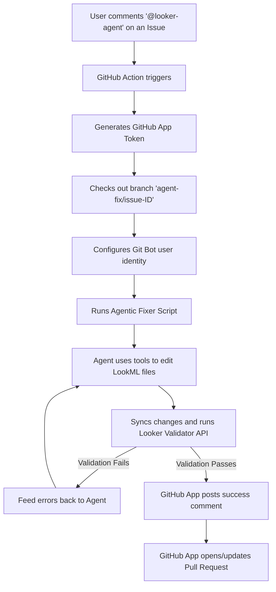

# LookML Auto-Fixer GitHub App Integration

We have integrated an autonomous AI LookML Fixer powered by the **Antigravity SDK** and the **Looker Python SDK** directly into this repository.

### Workflow Architecture
The integration is fully event-driven, operating through a GitHub App bot (`@looker-agent[bot]`).

### How to Trigger the Fixer
1. Go to any issue in this repository.
2. Ensure the issue has a clear request about changes needed for the LookML files.
3. Post a comment mentioning the bot:
   > `@looker-agent please apply the fixes requested here.`

This will spin up a GitHub Actions runner, check out the branch, and let the agent fix the files, compile-check them, and open a PR.

### Setup and Configuration
The integration uses a private GitHub App installed on the repository:
1. **GitHub Action Workflow:** Configured in [.github/workflows/agentic_lookml_fixer.yml](file:///.github/workflows/agentic_lookml_fixer.yml) which executes on `issue_comment: created` events, specifically when the comment body contains a mention of `@looker-agent`.
2. **Python Agent script:** Implemented in [.github/scripts/agentic_fixer.py](file:///.github/scripts/agentic_fixer.py).
3. **Repository Secrets:**
   - `GEMINI_API_KEY`: API key for model reasoning.
   - `LOOKER_AGENT_APP_ID` & `LOOKER_AGENT_APP_KEY`: Credentials for the GitHub App bot to authenticate and commit.
   - `LOOKERSDK_BASE_URL`, `LOOKERSDK_CLIENT_ID`, `LOOKERSDK_CLIENT_SECRET`: Looker API connection credentials for run-time compilation validation.
